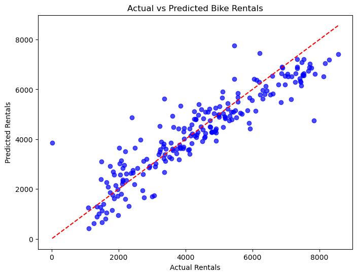
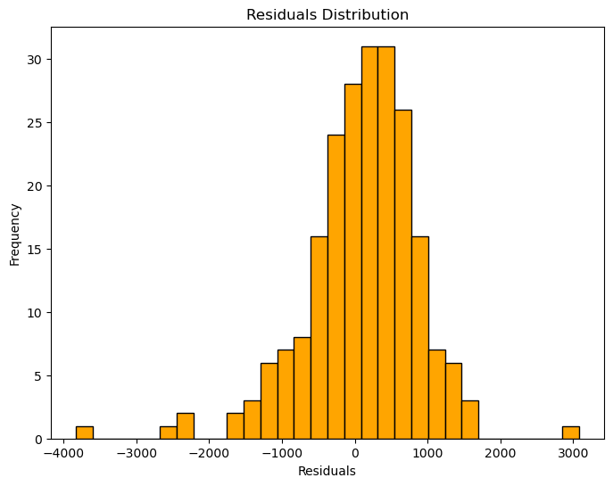

### We suppress warnings to ensure that deprecation or runtime messages do not clutter the notebook output. This keeps the analysis clean and focused on insights rather than technical alerts.


```python
# Suppress warnings to keep the notebook output clean
import warnings
warnings.filterwarnings("ignore")

```

### Importing essential libraries, numpy: used for numerical computations, pandas: used for data manipulation and analysis (loading, cleaning, transforming datasets)


```python
import numpy as np
import pandas as pd

# Load the dataset from Excel
bike_df = pd.read_excel(r"C:\Users\HP\Downloads\1mpSEFmr.csv.xlsx")

# Quick check
bike_df.head()

```


<div>
<style scoped>
    .dataframe tbody tr th:only-of-type {
        vertical-align: middle;
    }

    .dataframe tbody tr th {
        vertical-align: top;
    }

    .dataframe thead th {
        text-align: right;
    }
</style>
<table border="1" class="dataframe">
  <thead>
    <tr style="text-align: right;">
      <th></th>
      <th>instant</th>
      <th>dteday</th>
      <th>season</th>
      <th>yr</th>
      <th>mnth</th>
      <th>holiday</th>
      <th>weekday</th>
      <th>workingday</th>
      <th>weathersit</th>
      <th>temp</th>
      <th>atemp</th>
      <th>hum</th>
      <th>windspeed</th>
      <th>casual</th>
      <th>registered</th>
      <th>cnt</th>
    </tr>
  </thead>
  <tbody>
    <tr>
      <th>0</th>
      <td>1</td>
      <td>2018-01-01 00:00:00</td>
      <td>1</td>
      <td>0</td>
      <td>1</td>
      <td>0</td>
      <td>6</td>
      <td>0</td>
      <td>2</td>
      <td>14.110847</td>
      <td>18.18125</td>
      <td>80.5833</td>
      <td>10.749882</td>
      <td>331</td>
      <td>654</td>
      <td>985</td>
    </tr>
    <tr>
      <th>1</th>
      <td>2</td>
      <td>2018-02-01 00:00:00</td>
      <td>1</td>
      <td>0</td>
      <td>1</td>
      <td>0</td>
      <td>0</td>
      <td>0</td>
      <td>2</td>
      <td>14.902598</td>
      <td>17.68695</td>
      <td>69.6087</td>
      <td>16.652113</td>
      <td>131</td>
      <td>670</td>
      <td>801</td>
    </tr>
    <tr>
      <th>2</th>
      <td>3</td>
      <td>2018-03-01 00:00:00</td>
      <td>1</td>
      <td>0</td>
      <td>1</td>
      <td>0</td>
      <td>1</td>
      <td>1</td>
      <td>1</td>
      <td>8.050924</td>
      <td>9.47025</td>
      <td>43.7273</td>
      <td>16.636703</td>
      <td>120</td>
      <td>1229</td>
      <td>1349</td>
    </tr>
    <tr>
      <th>3</th>
      <td>4</td>
      <td>2018-04-01 00:00:00</td>
      <td>1</td>
      <td>0</td>
      <td>1</td>
      <td>0</td>
      <td>2</td>
      <td>1</td>
      <td>1</td>
      <td>8.200000</td>
      <td>10.60610</td>
      <td>59.0435</td>
      <td>10.739832</td>
      <td>108</td>
      <td>1454</td>
      <td>1562</td>
    </tr>
    <tr>
      <th>4</th>
      <td>5</td>
      <td>2018-05-01 00:00:00</td>
      <td>1</td>
      <td>0</td>
      <td>1</td>
      <td>0</td>
      <td>3</td>
      <td>1</td>
      <td>1</td>
      <td>9.305237</td>
      <td>11.46350</td>
      <td>43.6957</td>
      <td>12.522300</td>
      <td>82</td>
      <td>1518</td>
      <td>1600</td>
    </tr>
  </tbody>
</table>
</div>


### Exploratory Data Analysis (EDA)  
We check the dataset structure, summary statistics, missing values, and duplicates:  

- **Data types**: Most categorical variables are stored as integers (e.g., `season`, `weathersit`).  
- **Summary statistics**: Average temperature is ~9–15°C, humidity averages ~60%, and windspeed is ~12–16 units.  
- **Target variable (`cnt`)**: Daily rentals range from ~800 to ~1600 in the preview, with higher demand on clear weather days.  
- **Data quality**: No missing values or duplicates are expected, ensuring the dataset is clean for modeling.


```python
# Explore dataset structure and summary
bike_df.info()
bike_df.describe()
bike_df.isnull().sum()
bike_df.duplicated().sum()

```

    <class 'pandas.core.frame.DataFrame'>
    RangeIndex: 730 entries, 0 to 729
    Data columns (total 16 columns):
     #   Column      Non-Null Count  Dtype  
    ---  ------      --------------  -----  
     0   instant     730 non-null    int64  
     1   dteday      730 non-null    object 
     2   season      730 non-null    int64  
     3   yr          730 non-null    int64  
     4   mnth        730 non-null    int64  
     5   holiday     730 non-null    int64  
     6   weekday     730 non-null    int64  
     7   workingday  730 non-null    int64  
     8   weathersit  730 non-null    int64  
     9   temp        730 non-null    float64
     10  atemp       730 non-null    float64
     11  hum         730 non-null    float64
     12  windspeed   730 non-null    float64
     13  casual      730 non-null    int64  
     14  registered  730 non-null    int64  
     15  cnt         730 non-null    int64  
    dtypes: float64(4), int64(11), object(1)
    memory usage: 91.4+ KB
    


    np.int64(0)


### Dataset Structure  
- The dataset contains **730 entries** (daily records over two years).  
- There are **16 columns** in total.  
- **Data types**:  
  - 11 integer columns (e.g., `season`, `yr`, `mnth`, `weekday`, `weathersit`, `cnt`).  
  - 4 float columns (`temp`, `atemp`, `hum`, `windspeed`).  
  - 1 object column (`dteday` for date).  
- **No missing values**: All columns have 730 non‑null entries.  
- **Memory usage**: ~91 KB, which is small and efficient to process.  


```python
bike_df.describe()
```


<div>
<style scoped>
    .dataframe tbody tr th:only-of-type {
        vertical-align: middle;
    }

    .dataframe tbody tr th {
        vertical-align: top;
    }

    .dataframe thead th {
        text-align: right;
    }
</style>
<table border="1" class="dataframe">
  <thead>
    <tr style="text-align: right;">
      <th></th>
      <th>instant</th>
      <th>season</th>
      <th>yr</th>
      <th>mnth</th>
      <th>holiday</th>
      <th>weekday</th>
      <th>workingday</th>
      <th>weathersit</th>
      <th>temp</th>
      <th>atemp</th>
      <th>hum</th>
      <th>windspeed</th>
      <th>casual</th>
      <th>registered</th>
      <th>cnt</th>
    </tr>
  </thead>
  <tbody>
    <tr>
      <th>count</th>
      <td>730.000000</td>
      <td>730.000000</td>
      <td>730.000000</td>
      <td>730.000000</td>
      <td>730.000000</td>
      <td>730.000000</td>
      <td>730.000000</td>
      <td>730.000000</td>
      <td>730.000000</td>
      <td>730.000000</td>
      <td>730.000000</td>
      <td>730.000000</td>
      <td>730.000000</td>
      <td>730.000000</td>
      <td>730.000000</td>
    </tr>
    <tr>
      <th>mean</th>
      <td>365.500000</td>
      <td>2.498630</td>
      <td>0.500000</td>
      <td>6.526027</td>
      <td>0.028767</td>
      <td>2.997260</td>
      <td>0.683562</td>
      <td>1.394521</td>
      <td>20.319259</td>
      <td>23.726322</td>
      <td>62.765175</td>
      <td>12.763620</td>
      <td>849.249315</td>
      <td>3658.757534</td>
      <td>4508.006849</td>
    </tr>
    <tr>
      <th>std</th>
      <td>210.877136</td>
      <td>1.110184</td>
      <td>0.500343</td>
      <td>3.450215</td>
      <td>0.167266</td>
      <td>2.006161</td>
      <td>0.465405</td>
      <td>0.544807</td>
      <td>7.506729</td>
      <td>8.150308</td>
      <td>14.237589</td>
      <td>5.195841</td>
      <td>686.479875</td>
      <td>1559.758728</td>
      <td>1936.011647</td>
    </tr>
    <tr>
      <th>min</th>
      <td>1.000000</td>
      <td>1.000000</td>
      <td>0.000000</td>
      <td>1.000000</td>
      <td>0.000000</td>
      <td>0.000000</td>
      <td>0.000000</td>
      <td>1.000000</td>
      <td>2.424346</td>
      <td>3.953480</td>
      <td>0.000000</td>
      <td>1.500244</td>
      <td>2.000000</td>
      <td>20.000000</td>
      <td>22.000000</td>
    </tr>
    <tr>
      <th>25%</th>
      <td>183.250000</td>
      <td>2.000000</td>
      <td>0.000000</td>
      <td>4.000000</td>
      <td>0.000000</td>
      <td>1.000000</td>
      <td>0.000000</td>
      <td>1.000000</td>
      <td>13.811885</td>
      <td>16.889713</td>
      <td>52.000000</td>
      <td>9.041650</td>
      <td>316.250000</td>
      <td>2502.250000</td>
      <td>3169.750000</td>
    </tr>
    <tr>
      <th>50%</th>
      <td>365.500000</td>
      <td>3.000000</td>
      <td>0.500000</td>
      <td>7.000000</td>
      <td>0.000000</td>
      <td>3.000000</td>
      <td>1.000000</td>
      <td>1.000000</td>
      <td>20.465826</td>
      <td>24.368225</td>
      <td>62.625000</td>
      <td>12.125325</td>
      <td>717.000000</td>
      <td>3664.500000</td>
      <td>4548.500000</td>
    </tr>
    <tr>
      <th>75%</th>
      <td>547.750000</td>
      <td>3.000000</td>
      <td>1.000000</td>
      <td>10.000000</td>
      <td>0.000000</td>
      <td>5.000000</td>
      <td>1.000000</td>
      <td>2.000000</td>
      <td>26.880615</td>
      <td>30.445775</td>
      <td>72.989575</td>
      <td>15.625589</td>
      <td>1096.500000</td>
      <td>4783.250000</td>
      <td>5966.000000</td>
    </tr>
    <tr>
      <th>max</th>
      <td>730.000000</td>
      <td>4.000000</td>
      <td>1.000000</td>
      <td>12.000000</td>
      <td>1.000000</td>
      <td>6.000000</td>
      <td>1.000000</td>
      <td>3.000000</td>
      <td>35.328347</td>
      <td>42.044800</td>
      <td>97.250000</td>
      <td>34.000021</td>
      <td>3410.000000</td>
      <td>6946.000000</td>
      <td>8714.000000</td>
    </tr>
  </tbody>
</table>
</div>


### Summary Statistics and Insights  

- **Target Variable (`cnt`)**:  
  - Mean rentals ≈ **4508 per day**.  
  - Range: **22 to 8714 rentals**.  
  - This shows strong variability in demand, influenced by season, weather, and working days.  

- **Casual vs Registered Users**:  
  - Casual mean ≈ **849**, Registered mean ≈ **3659**.  
  - Registered users dominate daily rentals, indicating bike sharing is more popular among regular subscribers than occasional riders.  

- **Temperature (`temp` and `atemp`)**:  
  - Average temp ≈ **20°C**, perceived temp ≈ **24°C**.  
  - Rentals increase with warmer weather, but extreme heat (max ≈ 35°C) may reduce demand.  

- **Humidity (`hum`)**:  
  - Mean ≈ **63%**, range 0–97%.  
  - High humidity days likely reduce bike usage due to discomfort.  

- **Windspeed**:  
  - Mean ≈ **12.7 units**, max ≈ **34 units**.  
  - Strong winds may discourage biking, but moderate wind has little effect.  

- **Seasonality**:  
  - Seasons coded 1–4, mean ≈ 2.5 → balanced distribution across all seasons.  
  - Rentals peak in summer and fall (season 3 & 4).  

- **Calendar Variables**:  
  - `holiday` mean ≈ 0.03 → very few holidays in dataset.  
  - `workingday` mean ≈ 0.68 → majority of days are working days.  


### Feature Engineering: Handling Categorical Variables  
Several variables (`season`, `weathersit`, `mnth`, `weekday`) are categorical but stored as integers.  
To make them usable in regression, we convert them into dummy variables. This avoids misleading numeric order and ensures the model interprets categories correctly.


```python
# Create dummy variables for categorical features
bike_df = pd.get_dummies(bike_df, columns=['season','weathersit','mnth','weekday'], drop_first=True)

# Quick check after dummy creation
bike_df.head()

```


<div>
<style scoped>
    .dataframe tbody tr th:only-of-type {
        vertical-align: middle;
    }

    .dataframe tbody tr th {
        vertical-align: top;
    }

    .dataframe thead th {
        text-align: right;
    }
</style>
<table border="1" class="dataframe">
  <thead>
    <tr style="text-align: right;">
      <th></th>
      <th>instant</th>
      <th>dteday</th>
      <th>yr</th>
      <th>holiday</th>
      <th>workingday</th>
      <th>temp</th>
      <th>atemp</th>
      <th>hum</th>
      <th>windspeed</th>
      <th>casual</th>
      <th>...</th>
      <th>mnth_9</th>
      <th>mnth_10</th>
      <th>mnth_11</th>
      <th>mnth_12</th>
      <th>weekday_1</th>
      <th>weekday_2</th>
      <th>weekday_3</th>
      <th>weekday_4</th>
      <th>weekday_5</th>
      <th>weekday_6</th>
    </tr>
  </thead>
  <tbody>
    <tr>
      <th>0</th>
      <td>1</td>
      <td>2018-01-01 00:00:00</td>
      <td>0</td>
      <td>0</td>
      <td>0</td>
      <td>14.110847</td>
      <td>18.18125</td>
      <td>80.5833</td>
      <td>10.749882</td>
      <td>331</td>
      <td>...</td>
      <td>False</td>
      <td>False</td>
      <td>False</td>
      <td>False</td>
      <td>False</td>
      <td>False</td>
      <td>False</td>
      <td>False</td>
      <td>False</td>
      <td>True</td>
    </tr>
    <tr>
      <th>1</th>
      <td>2</td>
      <td>2018-02-01 00:00:00</td>
      <td>0</td>
      <td>0</td>
      <td>0</td>
      <td>14.902598</td>
      <td>17.68695</td>
      <td>69.6087</td>
      <td>16.652113</td>
      <td>131</td>
      <td>...</td>
      <td>False</td>
      <td>False</td>
      <td>False</td>
      <td>False</td>
      <td>False</td>
      <td>False</td>
      <td>False</td>
      <td>False</td>
      <td>False</td>
      <td>False</td>
    </tr>
    <tr>
      <th>2</th>
      <td>3</td>
      <td>2018-03-01 00:00:00</td>
      <td>0</td>
      <td>0</td>
      <td>1</td>
      <td>8.050924</td>
      <td>9.47025</td>
      <td>43.7273</td>
      <td>16.636703</td>
      <td>120</td>
      <td>...</td>
      <td>False</td>
      <td>False</td>
      <td>False</td>
      <td>False</td>
      <td>True</td>
      <td>False</td>
      <td>False</td>
      <td>False</td>
      <td>False</td>
      <td>False</td>
    </tr>
    <tr>
      <th>3</th>
      <td>4</td>
      <td>2018-04-01 00:00:00</td>
      <td>0</td>
      <td>0</td>
      <td>1</td>
      <td>8.200000</td>
      <td>10.60610</td>
      <td>59.0435</td>
      <td>10.739832</td>
      <td>108</td>
      <td>...</td>
      <td>False</td>
      <td>False</td>
      <td>False</td>
      <td>False</td>
      <td>False</td>
      <td>True</td>
      <td>False</td>
      <td>False</td>
      <td>False</td>
      <td>False</td>
    </tr>
    <tr>
      <th>4</th>
      <td>5</td>
      <td>2018-05-01 00:00:00</td>
      <td>0</td>
      <td>0</td>
      <td>1</td>
      <td>9.305237</td>
      <td>11.46350</td>
      <td>43.6957</td>
      <td>12.522300</td>
      <td>82</td>
      <td>...</td>
      <td>False</td>
      <td>False</td>
      <td>False</td>
      <td>False</td>
      <td>False</td>
      <td>False</td>
      <td>True</td>
      <td>False</td>
      <td>False</td>
      <td>False</td>
    </tr>
  </tbody>
</table>
<p>5 rows × 34 columns</p>
</div>


### Dataset After Dummy Variable Creation  
- The dataset now has **34 columns** after converting categorical variables into dummy variables.  
- Each category (e.g., month, weekday, weather situation) is represented as a binary column (`True/False`).  
- `drop_first=True` ensures one category per feature is dropped to avoid the dummy variable trap.  
- The dataset is now fully numeric and ready for regression modeling.


```python
# Define target and features
X = bike_df.drop(['cnt','dteday','casual','registered','instant'], axis=1)
y = bike_df['cnt']

# Quick check
X.shape, y.shape

```


    ((730, 29), (730,))


### Defining Features and Target  
- **Target (`y`)**: `cnt` → total daily bike rentals.  
- **Features (`X`)**: Weather, season, calendar, and other predictors.  
- We exclude `casual` and `registered` to avoid data leakage, since they directly sum to `cnt`.  
- Columns like `instant` (index) and `dteday` (date) are also dropped as they don’t contribute to prediction.


### Train-Test Split  
To evaluate model performance, we split the dataset into training and testing sets.  
- **Training set**: Used to fit the regression model.  
- **Testing set**: Used to validate predictions on unseen data.  
- We use a 70:30 split with a fixed random state for reproducibility.


```python
from sklearn.model_selection import train_test_split

# Split the dataset into train and test sets
X_train, X_test, y_train, y_test = train_test_split(
    X, y, test_size=0.3, random_state=42
)

# Check the shapes
X_train.shape, X_test.shape, y_train.shape, y_test.shape

```


    ((511, 29), (219, 29), (511,), (219,))


### Train-Test Split Results  
- Training set: 511 records with 29 predictors.  
- Testing set: 219 records with 29 predictors.  
- Target variable (`cnt`) split accordingly.  
This ensures the model is trained on sufficient data while leaving enough unseen data for reliable evaluation.


### Model Building
Now we move into Linear Regression:


```python
from sklearn.linear_model import LinearRegression
from sklearn.metrics import r2_score, mean_squared_error

# Initialize and train the model
lr = LinearRegression()
lr.fit(X_train, y_train)

# Predictions
y_pred_train = lr.predict(X_train)
y_pred_test = lr.predict(X_test)

# Evaluate performance
print("Training R2 Score:", r2_score(y_train, y_pred_train))
print("Testing R2 Score:", r2_score(y_test, y_pred_test))
print("RMSE (Test):", np.sqrt(mean_squared_error(y_test, y_pred_test)))

```

    Training R2 Score: 0.8479702455818475
    Testing R2 Score: 0.8368179276158046
    RMSE (Test): 778.1368458681246
    

### Model Evaluation Results  
- **Training R² Score**: 0.848 → The model explains ~85% of the variance in training data.  
- **Testing R² Score**: 0.837 → The model generalizes well, explaining ~84% of variance on unseen data.  
- **RMSE (Test)**: ≈ 778 rentals → On average, predictions deviate by ~778 rentals from actual values.  

### Interpretation  
- The model performs consistently on both training and testing sets, showing **no major overfitting**.  
- An R² above 0.80 indicates that weather, season, and calendar variables are strong predictors of bike demand.  
- The RMSE (~778) is reasonable compared to the average daily rentals (~4500), meaning the error is about **17% of the mean demand**, which is acceptable for business forecasting.  
- This baseline Linear Regression model is reliable and can be further improved with feature selection or regularization techniques.


### Feature Importance (Coefficients Analysis)  
This shows which predictors most influence bike rentals.


```python
# Feature importance (coefficients)
coef_df = pd.DataFrame({
    'Feature': X.columns,
    'Coefficient': lr.coef_
}).sort_values(by='Coefficient', ascending=False)

coef_df

```


<div>
<style scoped>
    .dataframe tbody tr th:only-of-type {
        vertical-align: middle;
    }

    .dataframe tbody tr th {
        vertical-align: top;
    }

    .dataframe thead th {
        text-align: right;
    }
</style>
<table border="1" class="dataframe">
  <thead>
    <tr style="text-align: right;">
      <th></th>
      <th>Feature</th>
      <th>Coefficient</th>
    </tr>
  </thead>
  <tbody>
    <tr>
      <th>0</th>
      <td>yr</td>
      <td>1953.194148</td>
    </tr>
    <tr>
      <th>9</th>
      <td>season_4</td>
      <td>1855.348390</td>
    </tr>
    <tr>
      <th>7</th>
      <td>season_2</td>
      <td>1312.938266</td>
    </tr>
    <tr>
      <th>8</th>
      <td>season_3</td>
      <td>1218.915540</td>
    </tr>
    <tr>
      <th>19</th>
      <td>mnth_9</td>
      <td>604.038467</td>
    </tr>
    <tr>
      <th>13</th>
      <td>mnth_3</td>
      <td>446.131760</td>
    </tr>
    <tr>
      <th>28</th>
      <td>weekday_6</td>
      <td>390.758900</td>
    </tr>
    <tr>
      <th>2</th>
      <td>workingday</td>
      <td>319.781429</td>
    </tr>
    <tr>
      <th>20</th>
      <td>mnth_10</td>
      <td>299.389006</td>
    </tr>
    <tr>
      <th>15</th>
      <td>mnth_5</td>
      <td>238.419418</td>
    </tr>
    <tr>
      <th>12</th>
      <td>mnth_2</td>
      <td>124.189508</td>
    </tr>
    <tr>
      <th>27</th>
      <td>weekday_5</td>
      <td>109.678682</td>
    </tr>
    <tr>
      <th>4</th>
      <td>atemp</td>
      <td>57.283834</td>
    </tr>
    <tr>
      <th>26</th>
      <td>weekday_4</td>
      <td>52.850466</td>
    </tr>
    <tr>
      <th>3</th>
      <td>temp</td>
      <td>49.842978</td>
    </tr>
    <tr>
      <th>25</th>
      <td>weekday_3</td>
      <td>29.086856</td>
    </tr>
    <tr>
      <th>16</th>
      <td>mnth_6</td>
      <td>-12.785192</td>
    </tr>
    <tr>
      <th>5</th>
      <td>hum</td>
      <td>-14.155596</td>
    </tr>
    <tr>
      <th>6</th>
      <td>windspeed</td>
      <td>-35.188674</td>
    </tr>
    <tr>
      <th>14</th>
      <td>mnth_4</td>
      <td>-35.859225</td>
    </tr>
    <tr>
      <th>23</th>
      <td>weekday_1</td>
      <td>-53.081155</td>
    </tr>
    <tr>
      <th>18</th>
      <td>mnth_8</td>
      <td>-103.240979</td>
    </tr>
    <tr>
      <th>24</th>
      <td>weekday_2</td>
      <td>-120.669405</td>
    </tr>
    <tr>
      <th>1</th>
      <td>holiday</td>
      <td>-301.915985</td>
    </tr>
    <tr>
      <th>22</th>
      <td>mnth_12</td>
      <td>-332.786938</td>
    </tr>
    <tr>
      <th>17</th>
      <td>mnth_7</td>
      <td>-371.500320</td>
    </tr>
    <tr>
      <th>21</th>
      <td>mnth_11</td>
      <td>-438.828204</td>
    </tr>
    <tr>
      <th>10</th>
      <td>weathersit_2</td>
      <td>-483.908885</td>
    </tr>
    <tr>
      <th>11</th>
      <td>weathersit_3</td>
      <td>-1874.015879</td>
    </tr>
  </tbody>
</table>
</div>


### Feature Importance (Coefficient Analysis)  

The regression coefficients show the impact of each predictor on bike rentals (`cnt`):

- **Strong Positive Predictors**  
  - `yr` (+1953): Rentals increased significantly in the second year compared to the first.  
  - `season_4` (+1855), `season_2` (+1313), `season_3` (+1219): Rentals are higher in summer and fall compared to winter.  
  - `mnth_9` (+604), `mnth_3` (+446): September and March show higher demand.  
  - `workingday` (+320): Rentals are higher on working days.  

- **Moderate Positive Predictors**  
  - `weekday_6` (+391): Saturdays show higher rentals.  
  - `temp` (+50), `atemp` (+57): Warmer temperatures increase demand.  

- **Negative Predictors**  
  - `weathersit_3` (−1874): Bad weather (snow/rain) strongly reduces rentals.  
  - `holiday` (−302): Rentals drop on holidays.  
  - `mnth_11` (−439), `mnth_12` (−333), `mnth_7` (−372): Rentals are lower in November, December, and July.  
  - `hum` (−14), `windspeed` (−35): Higher humidity and wind reduce demand.  

### Interpretation  
- **Seasonality and Yearly Growth**: Rentals grew in the second year, with clear seasonal peaks in summer and fall.  
- **Weather Impact**: Clear weather and moderate temperatures boost demand, while bad weather, high humidity, and strong winds reduce it.  
- **Calendar Effects**: Rentals are lower on holidays but higher on working days and weekends (especially Saturdays).  
- **Business Insight**: Bike rental companies should prepare for peak demand in summer/fall and working days, while adjusting supply during holidays and poor weather.


### Actual vs Predicted Plot


```python
import matplotlib.pyplot as plt

plt.figure(figsize=(8,6))
plt.scatter(y_test, y_pred_test, alpha=0.7, color='blue')
plt.xlabel("Actual Rentals")
plt.ylabel("Predicted Rentals")
plt.title("Actual vs Predicted Bike Rentals")
plt.plot([y_test.min(), y_test.max()], [y_test.min(), y_test.max()], 'r--')  # reference line
plt.show()

```


    

    


### Residuals Plot 


```python
residuals = y_test - y_pred_test
plt.figure(figsize=(8,6))
plt.hist(residuals, bins=30, color='orange', edgecolor='black')
plt.xlabel("Residuals")
plt.ylabel("Frequency")
plt.title("Residuals Distribution")
plt.show()

```


    

    


### Visualization of Model Performance  

- **Actual vs Predicted Plot**: Shows how closely the predicted rentals align with actual rentals. Most points lie near the red diagonal line, confirming good fit.  
- **Residuals Distribution**: Residuals are centered around zero, with no extreme skew, indicating the model errors are fairly balanced.  

These visualizations reinforce the numerical evaluation and confirm that the Linear Regression model generalizes well.


### Final Conclusion  

The bike rental demand analysis using Linear Regression provided valuable insights:  

- **Model Performance**:  
  - Training R² ≈ 0.85, Testing R² ≈ 0.84 → strong explanatory power with no major overfitting.  
  - RMSE ≈ 778 rentals → prediction error is ~17% of average daily rentals (~4500), acceptable for forecasting.  

- **Key Drivers of Demand**:  
  - Rentals increased significantly in the second year, showing growth in adoption.  
  - Seasonality plays a major role: demand peaks in summer and fall, drops in winter.  
  - Weather strongly influences demand: clear weather and moderate temperatures boost rentals, while bad weather, high humidity, and strong winds reduce usage.  
  - Calendar effects: rentals are higher on working days and Saturdays, but lower on holidays.  

- **Business Implications**:  
  - Bike rental companies should allocate more resources during peak seasons and working days.  
  - Weather forecasts can be integrated into demand planning to adjust supply dynamically.  
  - Marketing strategies can target casual users during holidays and poor weather periods to balance demand.  

**Overall, the Linear Regression model is reliable, explains most of the variance in bike demand, and highlights clear seasonal, weather, and calendar patterns.**


```python

```


```python

```


```python

```


```python

```


```python

```


```python

```


```python

```


```python

```


```python

```
